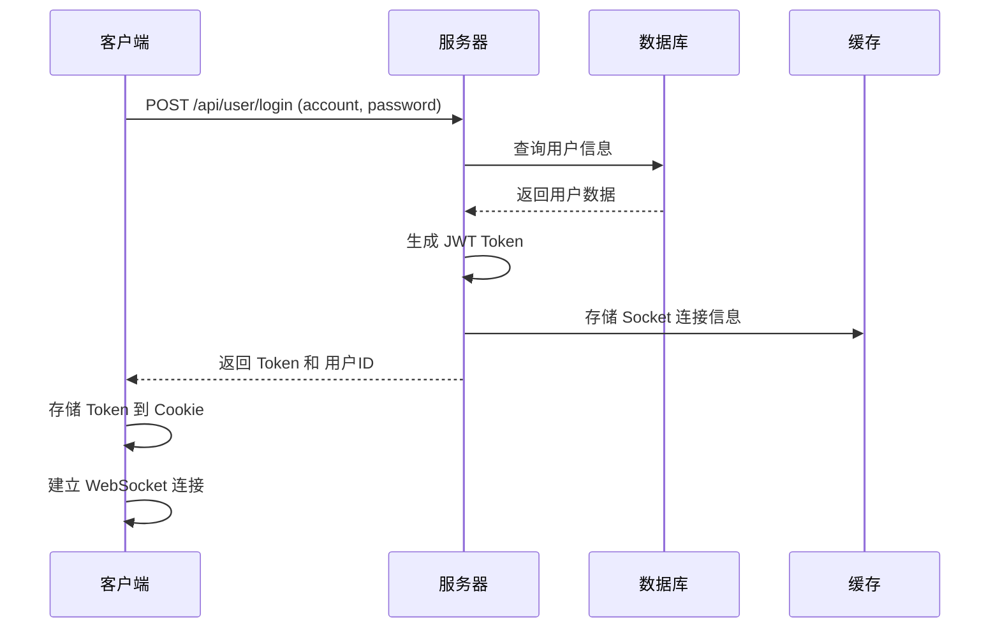

# MBSS 项目技术文档

## 项目概述

**项目名称**: mbss  
**项目描述**: a private Middle and backstage service  
**项目类型**: 后端服务  
**开发语言**: TypeScript  
**框架**: NestJS  
**数据库**: MySQL  
**缓存**: Redis  
**实时通信**: Socket.io

## 技术栈

### 核心框架

- **NestJS**: v11.1.14 - 企业级 Node.js 框架
- **TypeScript**: v5.9.3 - 类型安全的 JavaScript 超集
- **Node.js**: v18.20.3 - JavaScript 运行环境

### 数据库与缓存

- **MySQL**: mysql2 v3.18.2 - 关系型数据库
- **Redis**: ioredis v5.10.0 - 内存数据库/缓存
- **TypeORM**: v10.0.2 - ORM 框架

### 认证与安全

- **JWT**: @nestjs/jwt v11.0.2 - JSON Web Token 认证
- **Session**: express-session v1.19.0 - 会话管理
- **Cookie**: cookie-parser v1.4.7 - Cookie 解析

### API 文档与验证

- **Swagger**: @nestjs/swagger v11.2.6 - API 文档自动生成
- **Class-Validator**: v0.15.1 - 数据验证
- **Class-Transformer**: v0.5.1 - 数据转换

### 其他核心依赖

- **Axios**: v1.13.6 - HTTP 客户端
- **Socket.io**: v4.8.3 - WebSocket 通信
- **Multer**: @nestjs/platform-express v11.1.14 - 文件上传
- **Dayjs**: v1.11.19 - 日期处理

## 项目架构

### 目录结构

```
mbss/
├── src/
│   ├── common/              # 通用组件
│   │   ├── apiRoutes.ts        # API 路由管理
│   │   ├── auth.guard.ts        # 权限守卫
│   │   ├── events.gateway.ts    # WebSocket 网关
│   │   ├── http-exception.filter.ts  # 异常过滤器
│   │   ├── logger.middleware.ts  # 日志中间件
│   │   ├── request.service.ts   # HTTP 请求服务
│   │   ├── response.interceptor.ts # 响应拦截器
│   │   └── validation.pipe.ts   # 验证管道
│   ├── config/              # 配置管理
│   │   ├── config.default.ts   # 默认配置
│   │   ├── config.production.ts # 生产配置
│   │   ├── config.module.ts    # 配置模块
│   │   └── util.ts           # 工具函数
│   ├── modules/             # 业务模块
│   │   ├── file/            # 文件上传模块
│   │   │   ├── file.controller.ts
│   │   │   ├── file.dto.ts
│   │   │   └── file.module.ts
│   │   ├── user/            # 用户管理模块
│   │   │   ├── user.controller.ts
│   │   │   ├── user.dto.ts
│   │   │   ├── user.entity.ts
│   │   │   ├── user.service.ts
│   │   │   ├── role.entity.ts
│   │   │   └── user.module.ts
│   │   └── index.module.ts  # 模块索引
│   ├── app.module.ts        # 应用主模块
│   └── main.ts             # 应用入口
├── test/                  # 测试文件
├── package.json            # 项目依赖
├── tsconfig.json          # TypeScript 配置
└── README.md              # 项目说明
```

### 模块依赖关系

```
AppModule (根模块)
├── OConfigModule (配置模块)
│   ├── TypeOrmModule (数据库)
│   ├── RedisModule (缓存)
│   ├── JwtModule (JWT认证)
│   ├── MulterModule (文件上传)
│   └── HttpModule (HTTP请求)
├── EventsModule (WebSocket)
└── Modules (业务模块)
    ├── FileModule (文件上传)
    └── UserModule (用户管理)
        ├── UserController (用户控制器)
        └── UserService (用户服务)
            ├── UserRepository (用户仓储)
            └── RoleRepository (角色仓储)
```

## 核心功能模块

### 1. 用户管理模块

**文件**: `src/modules/user/`

#### 功能特性

- 用户增删改查 (CRUD)
- 角色管理
- 权限管理
- 登录认证
- 登出功能

#### 数据模型

**UserEntity** (用户实体)

```typescript
{
  id: number; // 自增ID
  account: string; // 账号
  password: string; // 密码
  phone: string; // 电话
  emil: string; // 邮箱
  role: RoleEntity; // 关联角色
  createTime: Date; // 创建时间
  updataTime: Date; // 更新时间
  lastLoginTime: Date; // 最后登录时间
  isDisable: boolean; // 是否禁用
}
```

**RoleEntity** (角色实体)

```typescript
{
  id: number;              // 自增ID
  name: string;           // 角色名称
  apiRoutes: string;       // API路由权限 (JSON数组)
  users: UserEntity[];     // 关联用户
  createTime: Date;        // 创建时间
  updataTime: Date;        // 更新时间
  isDisable: boolean;       // 是否禁用
}
```

#### API 接口

| 方法          | 路径                    | 描述           | 请求方式 |
| ------------- | ----------------------- | -------------- | -------- |
| addUser       | /api/user/addUser       | 添加用户       | POST     |
| findUsers     | /api/user/findUsers     | 查看所有用户   | GET      |
| updataUser    | /api/user/updataUser    | 更新用户       | POST     |
| edUser        | /api/user/edUser        | 启用或禁用用户 | GET      |
| findApiRoutes | /api/user/findApiRoutes | 查看所有路由   | GET      |
| addRole       | /api/user/addRole       | 添加权限       | POST     |
| findRoles     | /api/user/findRoles     | 查看所有权限   | GET      |
| updataRole    | /api/user/updataRole    | 更新权限       | POST     |
| edRole        | /api/user/edRole        | 启用或禁用权限 | GET      |
| login         | /api/user/login         | 登录           | POST     |
| loginOut      | /api/user/loginOut      | 登出           | GET      |

#### 权限控制机制

**基于角色的权限控制**:

1. 用户登录后获取 JWT Token
2. Token 存储在 Cookie 和 Session 中
3. 每个请求通过 AuthGuard 验证权限
4. 检查用户的角色是否包含当前 API 路由
5. 白名单路由无需认证 (如: `/api/user/login`)

### 2. 文件上传模块

**文件**: `src/modules/file/`

#### 功能特性

- 单文件上传
- 支持多种文件类型
- 自动生成唯一文件名
- 按日期组织文件存储

#### API 接口

| 方法   | 路径             | 描述         | 请求方式 |
| ------ | ---------------- | ------------ | -------- |
| upload | /api/file/upload | 上传单个文件 | POST     |

#### 文件存储策略

```typescript
// 文件存储路径: {项目根目录}/{项目名称}/{时间戳}-{原始文件名}
// 例如: /mbss/1709315200000-example.jpg
```

### 3. WebSocket 实时通信模块

**文件**: `src/common/events.gateway.ts`

#### 功能特性

- Socket.IO 实时通信
- 用户连接管理
- Redis 存储用户 Socket 连接
- 支持添加和删除 Socket 连接

#### WebSocket 事件

| 事件         | 描述     | 数据格式           |
| ------------ | -------- | ------------------ |
| addSocket    | 用户连接 | { userId: number } |
| delectSocket | 用户断开 | { userId: number } |

#### Redis 数据结构

```typescript
// Hash: socket
// Field: { userId: JSON.stringify({ socketId: string }) }
```

## 中间件与拦截器

### 1. 全局异常过滤器

**文件**: `src/common/http-exception.filter.ts`

**功能**: 统一异常处理

**响应格式**:

```typescript
{
  statusCode: number; // 状态码 (0表示成功，其他表示失败)
  timestamp: string; // 时间戳 (ISO 8601格式)
  path: string; // 请求路径
  message: string; // 提示信息
  data: any; // 返回数据
}
```

### 2. 全局响应拦截器

**文件**: `src/common/response.interceptor.ts`

**功能**: 统一响应格式

**拦截逻辑**:

1. 记录请求进入日志
2. 拦截响应数据
3. 包装为统一格式
4. 记录响应日志

### 3. 权限守卫

**文件**: `src/common/auth.guard.ts`

**功能**: 全局权限控制

**守卫逻辑**:

1. 检查请求路径是否在白名单中
2. 白名单路径直接放行
3. 非白名单路径验证用户权限
4. 检查用户角色是否包含当前 API 路由
5. 验证 Token 有效性和 Session 一致性

**白名单配置**:

```typescript
routerWhitelist: ['user/login', 'file/upload'];
```

### 4. 日志中间件

**文件**: `src/common/logger.middleware.ts`

**功能**: 请求日志记录

### 5. 验证管道

**文件**: `src/common/validation.pipe.ts`

**功能**: 请求数据验证

**验证流程**:

1. 检查是否需要验证
2. 使用 `class-transformer` 转换数据类型
3. 使用 `class-validator` 验证数据
4. 验证失败抛出异常

**类型转换配置**:

```typescript
enableImplicitConversion: true; // 启用隐式类型转换
```

## 配置管理

### 环境配置

**文件**: `src/config/util.ts`

**配置合并策略**:

1. 开发环境使用 `config.default.ts`
2. 生产环境使用 `config.production.ts`
3. 合并配置，生产配置覆盖开发配置
4. 提供默认值（项目名称、密钥等）

### 默认配置

**文件**: `src/config/config.default.ts`

**配置项**:

```typescript
{
  projectName: 'mbss';                    // 项目名称
  allowOrigin: 'http://localhost:3000';     // 允许的跨域来源
  routerWhitelist: ['user/login', 'file/upload'];  // 路由白名单

  // JWT 配置
  jwtSecret: {
    signOptions: {
      expiresIn: '7d',              // Token 有效期7天
    },
  },

  // Session 配置
  session: {
    secret: '',                      // Session 密钥
    resave: false,
    saveUninitialized: false,
    cookie: {
      maxAge: 7 * 24 * 60 * 60 * 1000,  // Cookie 有效期7天
    },
  },

  // MySQL 配置
  mysql: {
    type: 'mysql',
    host: '127.0.0.1',              // 数据库地址
    port: 3306,                      // 数据库端口
    username: 'root',                 // 数据库用户名
    password: '888888',                // 数据库密码
    database: 'mbss',                 // 数据库名称
    entities: ['**/*.entity{.ts,.js}'],  // 实体文件
    synchronize: true,                 // 自动同步数据库结构
    timezone: '+08:00',              // 时区
    logging: true,                    // 启用SQL日志
  },

  // Redis 配置
  redis: {
    config: {
      port: 6379,                   // Redis 端口
      host: '127.0.0.1',            // Redis 地址
      password: '',                    // Redis 密码
    },
  },

  // 文件上传配置
  file: {
    preservePath: true,               // 保留原始路径
  },
}
```

## 应用启动流程

### 启动入口

**文件**: `src/main.ts`

**启动步骤**:

1. 创建 NestJS 应用实例
2. 配置 CORS 跨域
3. 设置全局路由前缀 `/api`
4. 注册全局中间件（日志、Cookie、Session）
5. 注册全局拦截器（响应拦截）
6. 注册全局过滤器（异常处理）
7. 注册全局管道（数据验证）
8. 注册全局守卫（权限控制）
9. 配置 Swagger API 文档
10. 启动 HTTP 服务器（端口 9000）
11. 生成 API 路由 JSON 文件

### Swagger 文档

**访问地址**: `http://localhost:9000/api-doc/`

**文档配置**:

- 标题: mbss
- 描述: a private Middle and backstage service
- 版本: 1.0.0

## 数据库设计

### 用户表 (user)

| 字段名        | 类型     | 说明          | 约束          |
| ------------- | -------- | ------------- | ------------- |
| id            | number   | 自增ID        | PRIMARY KEY   |
| account       | string   | 账号          | UNIQUE        |
| password      | string   | 密码          | NOT NULL      |
| phone         | string   | 电话          |               |
| emil          | string   | 邮箱          |               |
| roleId        | number   | 角色ID (外键) | FOREIGN KEY   |
| createTime    | datetime | 创建时间      |               |
| updataTime    | datetime | 更新时间      |               |
| lastLoginTime | datetime | 最后登录时间  |               |
| isDisable     | boolean  | 是否禁用      | DEFAULT false |

### 角色表 (role)

| 字段名     | 类型     | 说明                   | 约束          |
| ---------- | -------- | ---------------------- | ------------- |
| id         | number   | 自增ID                 | PRIMARY KEY   |
| name       | string   | 角色名称               | UNIQUE        |
| apiRoutes  | text     | API路由权限 (JSON数组) |               |
| createTime | datetime | 创建时间               |               |
| updataTime | datetime | 更新时间               |               |
| isDisable  | boolean  | 是否禁用               | DEFAULT false |

### 关系

- 一个用户属于一个角色 (N:1)
- 一个角色可以有多个用户 (1:N)

## 认证流程

### 登录流程



### 权限验证流程

```mermaid
sequenceDiagram
    participant Client as 客户端
    participant Guard as 权限守卫
    participant Service as 用户服务
    participant DB as 数据库

    Client->>Guard: 请求 API (带 Token)
    Guard->>Guard: 检查是否在白名单
    alt 白名单
        Guard-->>Client: 放行请求
    else 非白名单
        Guard->>Service: 验证 Token
        Service->>DB: 查询用户和角色信息
        DB-->>Service: 返回用户和角色数据
        Service->>Service: 检查角色权限
        alt 有权限
            Service-->>Guard: 返回 true
            Guard-->>Client: 放行请求
        else 无权限
            Service-->>Guard: 抛出异常
            Guard-->>Client: 返回 401 错误
```

## 安全机制

### 1. JWT 认证

**Token 生成**:

- 使用用户 ID 和账号生成
- 有效期 7 天
- 签名密钥从配置读取

**Token 验证**:

- 从 Cookie 读取 Token
- 解析 Token 获取用户信息
- 验证 Token 有效期
- 检查 Session 中 Token 一致性

### 2. Session 管理

**Session 配置**:

- 存储用户 Token
- 有效期 7 天
- Cookie 存储

### 3. 密码安全

- 数据库中存储加密密码
- 登录时验证加密密码
- 响应中不返回密码

### 4. CORS 跨域

**配置**:

- 允许的来源: `http://localhost:3000`
- 允许的请求头: `Content-Type`, `Accept`
- 支持凭证传递

### 5. SQL 注入防护

- 使用 TypeORM 参数化查询
- 避免直接拼接 SQL
- 实体字段映射

## 性能优化

### 1. 数据库优化

**查询优化**:

- 使用索引（主键、唯一键）
- 分页查询（skip, take）
- 关联查询优化（relations）
- 缓存启用（cache: true）

### 2. 缓存策略

**Redis 缓存**:

- Socket 连接信息缓存
- 用户会话缓存
- 可扩展：API 响应缓存

### 3. 连接池

**TypeORM 配置**:

- 自动重连机制
- 连接池管理
- 查询超时控制

## 错误处理

### 异常分类

1. **业务异常**: 用户不存在、权限不足等
2. **验证异常**: 数据格式错误
3. **数据库异常**: 连接失败、查询错误
4. **系统异常**: 未知错误

### 错误响应格式

```typescript
{
  statusCode: 400,           // HTTP 状态码
  timestamp: "2026-03-01T10:38:48.038Z",
  path: "/api/user/findUsers",
  message: "请求失败",
  data: "页码必须是数字"  // 具体错误信息
}
```

## 部署说明

### 环境要求

- **Node.js**: v18.20.3+
- **MySQL**: v5.7+
- **Redis**: v6.0+
- **操作系统**: Linux/macOS/Windows

### 端口配置

- **应用端口**: 9000
- **MySQL 端口**: 3306
- **Redis 端口**: 6379

### 启动命令

```bash
# 开发环境
npm run dev

# 生产环境
npm run dev:prod

# 构建
npm run build

# 测试
npm run test
npm run test:e2e

# 代码检查
npm run lint
npm run format
```

### 环境变量

```bash
NODE_ENV=development  # 开发环境
NODE_ENV=production     # 生产环境
```

## 开发指南

### 添加新功能

1. 在 `src/modules/` 下创建新模块
2. 定义 Entity（数据模型）
3. 定义 DTO（数据传输对象）
4. 创建 Controller（控制器）
5. 创建 Service（业务逻辑）
6. 在 `index.module.ts` 中注册模块

### 添加新接口

1. 在 Controller 中添加方法
2. 使用装饰器定义路由（@Get, @Post, @Put, @Delete）
3. 添加 Swagger 文档（@ApiOperation, @ApiTags）
4. 在 Service 中实现业务逻辑
5. 在 DTO 中添加验证规则

### 权限配置

1. 在角色表中添加 API 路由
2. 确保用户登录后获取 Token
3. 通过 AuthGuard 自动验证权限
4. 白名单路由无需配置权限

## 常见问题

### 1. 数据库连接失败

**问题**: `connect ECONNREFUSED ::1:3306`

**解决方案**:

- 检查 MySQL 服务是否启动
- 确认数据库配置正确
- 检查防火墙设置

### 2. Redis 连接失败

**问题**: Redis 连接超时

**解决方案**:

- 检查 Redis 服务是否启动
- 确认 Redis 配置正确
- 检查网络连接

### 3. Token 验证失败

**问题**: `没有授权，请先登录`

**解决方案**:

- 确保已登录并获取 Token
- 检查 Token 是否过期
- 检查 Cookie 是否正确设置

### 4. 权限不足

**问题**: `您的账号没有此接口权限`

**解决方案**:

- 联系管理员分配相应权限
- 检查角色配置是否正确
- 确认 API 路由是否在角色权限中

## 技术亮点

### 1. 企业级架构

- 基于 NestJS 的模块化设计
- 依赖注入和装饰器模式
- 清晰的分层架构

### 2. 类型安全

- 全面的 TypeScript 类型定义
- 编译时类型检查
- 运行时类型验证

### 3. RESTful 设计

- 标准的 HTTP 方法
- 资源导向的 URL 设计
- 统一的响应格式

### 4. 实时通信

- Socket.IO WebSocket 支持
- Redis 缓存连接信息
- 支持多客户端连接

### 5. 自动化文档

- Swagger 自动生成 API 文档
- 在线测试接口
- 接口版本管理

## 版本信息

### 当前版本

- **项目版本**: 0.3.3
- **NestJS**: v11.1.14
- **TypeScript**: v5.9.3
- **TypeORM**: v10.0.2
- **MySQL**: mysql2 v3.18.2

### 依赖升级记录

详见 [DEPENDENCY_UPGRADE_REPORT.md](./DEPENDENCY_UPGRADE_REPORT.md)

## 联系方式

如有问题或建议，请联系开发团队。

---

**文档版本**: 1.0.0  
**最后更新**: 2026-03-01  
**维护者**: Development Team
